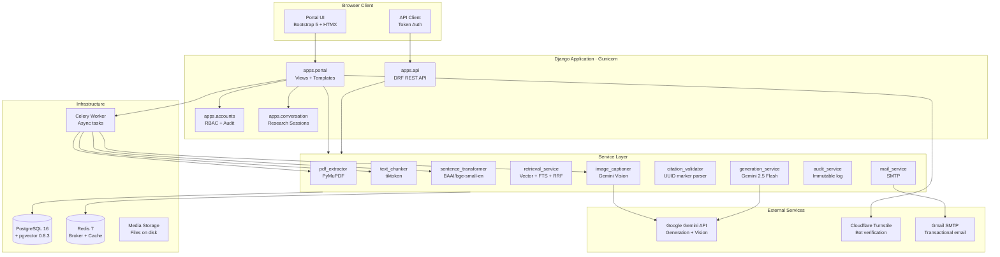
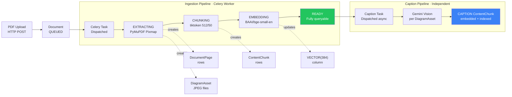
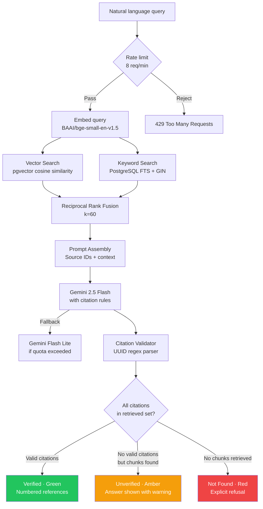
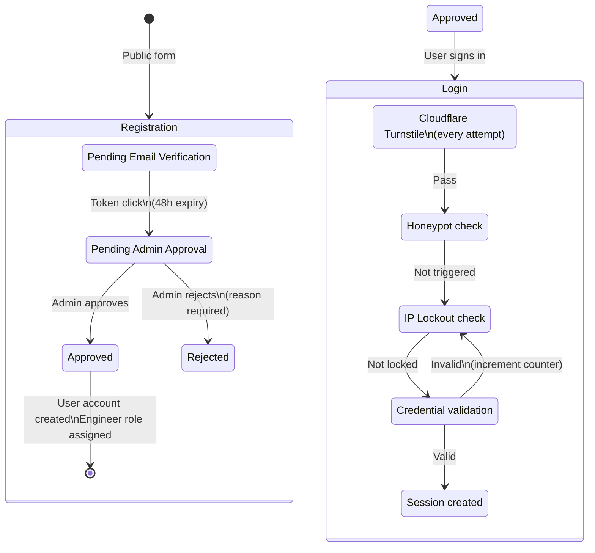
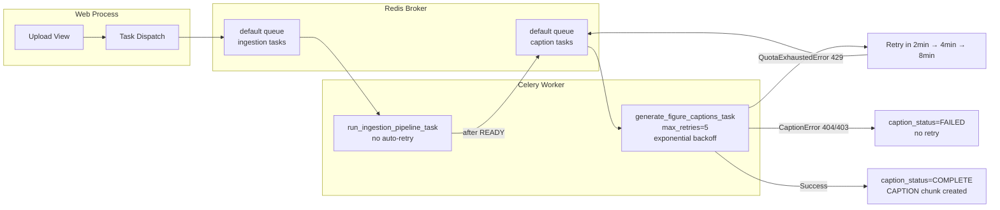

<div align="center">
<br />

<pre>
███████╗ █████╗  ██████╗ ███████╗
██╔════╝██╔══██╗██╔════╝ ██╔════╝
███████╗███████║██║  ███╗█████╗  
╚════██║██╔══██║██║   ██║██╔══╝  
███████║██║  ██║╚██████╔╝███████╗
╚══════╝╚═╝  ╚═╝ ╚═════╝ ╚══════╝
</pre>


# Standards and Guidelines Engine

**Citation-enforced engineering document intelligence for technical standards libraries**

<br />

[](https://python.org)
[](https://djangoproject.com)
[](https://postgresql.org)
[](https://celeryq.dev)
[](https://redis.io)
[](https://docker.com)
[](https://ai.google.dev)
[](#)
[](./tests)
[](./LICENSE)
[](https://rdso.indianrailways.gov.in)

<br />

<p align="center">
  <a href="#-quick-start">Quick Start</a> ·
  <a href="#-architecture">Architecture</a> ·
  <a href="#-features">Features</a> ·
  <a href="#-ai-pipeline">AI Pipeline</a> ·
  <a href="#-api">API</a> ·
  <a href="#-roadmap">Roadmap</a>
</p>

<br />

</div>

---

> **SAGE** is an engineering knowledge platform that transforms static PDF specifications into a queryable, citation-enforced intelligence system. Every answer is architecturally required to cite a specific clause in a specific document — the system structurally cannot produce an ungrounded response.

---

## The Problem

Engineering standards libraries are operationally critical and fundamentally inaccessible.

A track engineer at a railway organisation needing to verify a material specification must manually search through hundreds of pages across dozens of PDFs, cross-reference amendment circulars, reconcile conflicting clause versions, and locate the specific figure that illustrates the tolerance in question. This process takes anywhere from 15 minutes to several hours — for a single query.

General-purpose AI tools make this worse, not better. They answer every question confidently, in fluent prose, without revealing whether the answer was retrieved from a source or fabricated from parametric memory. In a domain where an incorrect tensile strength value can compromise structural safety, confident hallucination is more dangerous than no answer at all.

**SAGE's design position:** a document intelligence system for high-stakes engineering contexts has an obligation to refuse answering questions it cannot ground in evidence. Every answer must be traceable to a specific page and clause. Uncertainty must be surfaced, not hidden.

---

## Features

<details open>
<summary><strong>Engineering Intelligence</strong></summary>
<br />

| Feature | Description |
|---|---|
| **Hybrid Retrieval** | Dense vector search (pgvector) + PostgreSQL full-text search, fused with Reciprocal Rank Fusion |
| **Citation Enforcement** | Architectural guarantee: every factual claim links to a retrieved, verifiable document chunk |
| **Three-State Confidence** | Green (Verified) · Amber (Unverified) · Red (Not Found) — never a false positive |
| **Compliance Verification** | COMPLIANT / NON-COMPLIANT / INSUFFICIENT EVIDENCE verdicts with cited supporting clauses |
| **Cross-Document Comparison** | Structured Agreements · Conflicts · Exclusive-to-A · Exclusive-to-B analysis |
| **Conversational Context** | Document-scoped research sessions with configurable turn-window history |

</details>

<details open>
<summary><strong>Document Processing</strong></summary>
<br />

| Feature | Description |
|---|---|
| **PDF Extraction** | PyMuPDF Pixmap-based extraction handles RGB, CMYK, JBIG2, CCITT, and JPEG2000 embedded images |
| **Structured Chunking** | tiktoken cl100k_base tokeniser, 512-token chunks with 50-token overlap |
| **Section Parsing** | Clause identifiers extracted by regex (`4.3.2`, `Clause 7.1`, `Section 4`) into navigable hierarchy |
| **Figure Captioning** | Gemini Vision captions embedded as retrievable CAPTION chunks alongside text |
| **Clause Navigator** | Document outline reconstructed from section identifiers with citation frequency per clause |
| **Figure Explorer** | Caption-searchable gallery with thumbnails, page numbers, and investigation entry points |

</details>

<details open>
<summary><strong>Security & Access Control</strong></summary>
<br />

| Feature | Description |
|---|---|
| **Six-Tier RBAC** | Super User · System Admin · Document Manager · Reviewer · Engineer · Read Only |
| **Cloudflare Turnstile** | Bot verification on every login attempt, with arithmetic/word fallback when Turnstile is unreachable |
| **Honeypot Detection** | Hidden `contact_url` field silently rejects automated form submissions |
| **IP Lockout** | Redis-backed temporary IP block after configurable failure threshold |
| **Registration Workflow** | Email verification → admin approval → account activation — no open registration |
| **Audit Log** | Immutable, unified event log for all authentication, document, and research events |
| **Password Reset** | Django HMAC-signed, expiring, single-use tokens — email auto-filled for authenticated users |
| **Protected Media** | All uploaded PDFs and extracted images served through authenticated views |

</details>

<details open>
<summary><strong>Research Workspace</strong></summary>
<br />

| Feature | Description |
|---|---|
| **Named Investigations** | Sessions require a title before starting — forcing articulation of research purpose |
| **Numbered Findings** | Every Q&A pair is a numbered, dated finding with verification status |
| **Citation Side Panel** | Click any citation to inspect the source chunk in reading context with adjacent passages |
| **PDF Export** | ReportLab-generated A4 engineering report with findings, verdicts, and references |
| **Investigation History per Clause** | Clause Navigator shows which investigations cited each clause and what was concluded |

</details>

<details open>
<summary><strong>Developer Experience</strong></summary>
<br />

| Feature | Description |
|---|---|
| **Docker Compose** | Single command startup: database, Redis, Celery worker, and web server |
| **HTMX Frontend** | No JavaScript framework — declarative AJAX with self-canceling status polling |
| **272-Test Suite** | Unit and integration coverage across every module |
| **Evaluation Framework** | 20-question domain-calibrated dataset with automated citation and latency metrics |
| **REST API** | Token and session authentication, DRF serialisers, standard error format |
| **Management Commands** | `ingest_documents`, `create_demo_data` for rapid setup |

</details>

---

## Screenshots

<div align="center">

### Library Dashboard
<!-- Dashboard Screenshot -->
*Document library with stat cards, health indicators, and per-document clause/figure/investigation counts*

### Query Interface — Verified Answer
<!-- Query Interface — Green State -->
*Hybrid retrieval result with green Verified badge, numbered citations, and clickable source inspector*

### Citation Side Panel
<!-- Citation Side Panel -->
*In-place source inspector showing cited passage, adjacent context, and figure thumbnail for vision citations*

### Investigation Workspace
<!-- Research Workspace Screenshot -->
*Named investigation session with numbered findings, confidence badges, and Export PDF action*

### Figure Explorer
<!-- Figure Explorer Screenshot -->
*Caption-searchable figure gallery with AI-generated technical descriptions and Ask About This entry point*

### Clause Navigator
<!-- Clause Navigator Screenshot -->
*Hierarchical document outline with citation frequency badges and investigation history per clause*

### Compliance Verification
<!-- Compliance Query Screenshot -->
*COMPLIANT / NON-COMPLIANT / INSUFFICIENT EVIDENCE verdict with supporting clause citations*

### Admin Portal — Registration Review
<!-- Admin Portal Screenshot -->
*Administrator approval interface showing applicant details, department, and reason for access*

### Login Page
<!-- Login Page Screenshot -->
*Two-panel enterprise login with Cloudflare Turnstile, security status indicators, and monochrome design*

</div>

---

## Architecture

### System Overview



---

### Document Ingestion Pipeline



---

### Query & Generation Pipeline



---

### Authentication & Registration Workflow



---

### Background Processing Architecture



---

## Tech Stack

### Core Framework

| Component | Technology | Version | Purpose |
|---|---|---|---|
| Language | Python | 3.12 | Runtime |
| Web Framework | Django | 5.2.x | ORM, auth, views, admin |
| REST API | Django REST Framework | 3.x | Serialisers, token auth |
| Task Queue | Celery | 5.x | Async ingestion, captioning |
| WSGI Server | Gunicorn | 22.x | Production serving with optional TLS |

### Data & Storage

| Component | Technology | Version | Purpose |
|---|---|---|---|
| Primary Database | PostgreSQL | 16 | All relational data |
| Vector Extension | pgvector | 0.8.3 | `VECTOR(384)` type, cosine similarity |
| Message Broker | Redis | 7 | Celery broker (db 0), Django cache (db 1) |
| Static Files | WhiteNoise | 6.7.x | Compressed, cache-busted static serving |
| Media Files | Filesystem + Auth view | — | Authenticated PDF and image serving |

### AI & Intelligence

| Component | Technology | Model | Purpose |
|---|---|---|---|
| Text Embeddings | sentence-transformers | BAAI/bge-small-en-v1.5 (384d) | Local, CPU-deployable, no API cost |
| Tokenisation | tiktoken | cl100k_base | Exact chunk boundary decisions |
| Generation | Google Gemini | 2.5 Flash | Instruction-following, citation-aware |
| Vision / Captions | Google Gemini | 2.5 Flash (vision) | Figure caption generation |
| PDF Processing | PyMuPDF (fitz) | Latest | Pixmap extraction, text extraction |
| PDF Export | ReportLab | 4.x | Pure-Python, no system library deps |

### Frontend

| Component | Technology | Version | Purpose |
|---|---|---|---|
| CSS Framework | Bootstrap | 5.3.8 (vendored) | Layout, components, utilities |
| AJAX | HTMX | 2.0.10 (vendored) | Declarative partials, no JS framework |
| Fonts | System stack | — | No web font CDN dependency |

### Security

| Component | Technology | Purpose |
|---|---|---|
| Bot verification | Cloudflare Turnstile | Human verification on every login |
| Password hashing | PBKDF2-SHA256 (Django) | Secure credential storage |
| Token signing | `TimestampSigner` (Django) | Email verification, reset tokens |
| TLS | Gunicorn native | HTTPS in production mode |
| Email | Gmail SMTP / Anymail | Verification, reset, notifications |

---

## Repository Structure

```
sage/
├── config/                          # Django project configuration
│   ├── settings.py                  # Environment-driven settings
│   ├── urls.py                      # Root URL routing
│   └── celery.py                    # Celery application definition
│
├── apps/
│   ├── accounts/                    # Identity, RBAC, audit
│   │   ├── models.py                # Role, UserProfile, AuditLog, AccountRegistration
│   │   ├── permissions.py           # Permission constants + role defaults
│   │   ├── decorators.py            # @requires_permission decorator
│   │   ├── middleware.py            # RequiresPasswordResetMiddleware
│   │   ├── signals.py               # Auto-create UserProfile on User creation
│   │   ├── templatetags/
│   │   │   └── account_tags.py      #  
│   │   └── management/commands/
│   │       └── create_demo_data.py  # Demo users + pending registrations
│   │
│   ├── documents/                   # Document model and upload API
│   │   └── models.py                # Document, DocumentPage
│   │
│   ├── chunks/                      # ContentChunk and DiagramAsset
│   │   └── models.py                # ContentChunk (VECTOR 384), DiagramAsset
│   │
│   ├── ingestion/                   # Pipeline orchestration
│   │   ├── pipeline.py              # run_ingestion_pipeline()
│   │   ├── tasks.py                 # Celery tasks: ingest + caption
│   │   └── management/commands/
│   │       └── ingest_documents.py  # CLI bulk ingestion
│   │
│   ├── conversation/                # Research sessions
│   │   ├── models.py                # DocumentSession, ConversationTurn
│   │   └── services.py              # Session management, ask_in_session()
│   │
│   ├── api/                         # REST API
│   │   ├── views.py                 # DocumentUploadView, QueryView
│   │   └── serializers.py           # DRF serialisers
│   │
│   └── portal/                      # Frontend portal
│       ├── views.py                 # All portal views
│       ├── views_registration.py    # Registration workflow
│       ├── views_admin.py           # Administration portal
│       ├── views_password_reset.py  # Password reset (Django built-in subclass)
│       ├── urls.py                  # Portal URL patterns
│       ├── login_security.py        # Turnstile, honeypot, IP lockout
│       ├── rate_limit.py            # Per-user request rate limiter
│       ├── turnstile.py             # Cloudflare Siteverify integration
│       ├── templates/portal/        # All HTML templates
│       │   ├── base.html            # Dynamic nav, citation panel
│       │   ├── base_login.html      # Standalone login layout
│       │   ├── dashboard.html       # Library overview
│       │   ├── document_conversation.html
│       │   ├── document_figures.html
│       │   ├── document_outline.html
│       │   ├── compliance_query.html
│       │   ├── comparison.html
│       │   └── emails/              # All transactional email templates
│       └── static/portal/
│           ├── css/custom.css       # SAGE design tokens + components
│           └── vendor/              # Bootstrap 5.3.8, HTMX 2.0.10 (offline)
│
├── services/                        # Framework-independent business logic
│   ├── extractors/
│   │   └── pdf_extractor.py         # PyMuPDF Pixmap extraction
│   ├── chunkers/
│   │   └── text_chunker.py          # tiktoken sliding-window chunking
│   ├── llm_client/
│   │   ├── sentence_transformer_client.py
│   │   └── gemini_generation_client.py
│   ├── retrieval/
│   │   ├── vector_search.py         # pgvector cosine similarity
│   │   ├── keyword_search.py        # PostgreSQL FTS + GIN
│   │   ├── rrf.py                   # Reciprocal Rank Fusion
│   │   ├── retrieval_service.py     # Unified retrieve()
│   │   └── comparison.py           # Concurrent two-doc retrieval
│   ├── generation/
│   │   ├── prompts.py               # System + user prompts for all modes
│   │   ├── generation_service.py    # generate_answer(), compliance, comparison
│   │   ├── citation_validator.py    # [CITE:uuid] parser and validator
│   │   ├── answer_rendering.py      # [CITE:uuid] → [n] rendering
│   │   └── image_captioner.py       # Gemini vision captioning
│   ├── export/
│   │   └── investigation_pdf.py     # ReportLab A4 report generation
│   ├── documents/
│   │   └── clause_navigator.py      # Section hierarchy + citation history
│   ├── email/
│   │   └── mail_service.py          # All outbound email functions
│   └── audit/
│       └── audit_service.py         # log_event() + convenience functions
│
└── tests/
    ├── unit/                        # Pure function tests (no DB, no HTTP)
    ├── integration/                 # Full request-response tests
    └── evaluation/                  # 20-question domain evaluation framework
        ├── dataset.json
        └── run_evaluation.py
```

---

## Quick Start

### Prerequisites

- Docker Desktop 4.x
- Docker Compose v2
- A Google Gemini API key (free tier sufficient for development)
- A Gmail account with an App Password (for email features)

### 1. Clone and configure

```bash
git clone https://github.com/your-username/sage.git
cd sage
cp .env.example .env
```

Edit `.env` with your credentials:

```bash
# Required
DJANGO_SECRET_KEY=your-secret-key-here          # generate with: python -c "import secrets; print(secrets.token_urlsafe(50))"
GEMINI_API_KEY=your-gemini-api-key

# Email (Gmail SMTP)
EMAIL_BACKEND=django.core.mail.backends.smtp.EmailBackend
EMAIL_HOST=smtp.gmail.com
EMAIL_PORT=587
EMAIL_HOST_USER=your-address@gmail.com
EMAIL_HOST_PASSWORD=xxxx-xxxx-xxxx-xxxx         # Gmail App Password (16 chars)
DEFAULT_FROM_EMAIL=SAGE Platform <your-address@gmail.com>

# URLs
SITE_URL=http://localhost:8000                   # or https://localhost:8443 for TLS
```

### 2. Start services

```bash
docker compose up --build
```

This single command:
- Starts PostgreSQL 16 with pgvector
- Starts Redis 7
- Applies all Django migrations
- Collects static files
- Starts the Gunicorn web server
- Starts the Celery worker

### 3. Create your admin account

```bash
docker compose exec web python manage.py createsuperuser
```

### 4. (Optional) Load demo data

```bash
# Creates 3 pending registrations + 3 demo users with different roles
docker compose exec web python manage.py create_demo_data
```

### 5. Ingest documents

```bash
# Copy your PDFs into the container and ingest synchronously
docker compose cp /path/to/your/specifications/ web:/tmp/specs/
docker compose exec web python manage.py ingest_documents /tmp/specs/

# Check ingestion status
docker compose exec web python manage.py ingest_documents --status
```

### 6. Open SAGE

```
http://localhost:8000
```

Log in with your superuser credentials. The document library will be populated and immediately queryable.

---

## Environment Variables

<details>
<summary>Complete environment variable reference</summary>
<br />

### Core Django

| Variable | Default | Description |
|---|---|---|
| `DJANGO_SECRET_KEY` | **Required** | Cryptographic signing key — unique per deployment |
| `DEBUG` | `False` | Enable Django debug mode |
| `ALLOWED_HOSTS` | `localhost,127.0.0.1` | Comma-separated valid host headers |
| `DJANGO_RUN_SERVER_MODE` | `runserver` | Set to `gunicorn` for production |

### Database

| Variable | Default | Description |
|---|---|---|
| `DATABASE_URL` | **Required** | PostgreSQL connection string |
| `CELERY_BROKER_URL` | `redis://redis:6379/0` | Celery Redis broker |
| `DJANGO_CACHE_URL` | `redis://redis:6379/1` | Django cache (login security, rate limiting) |

### AI Services

| Variable | Default | Description |
|---|---|---|
| `GEMINI_API_KEY` | **Required** | Google Gemini API key |
| `GEMINI_MODEL` | `gemini-2.5-flash` | Primary generation model |
| `GEMINI_FALLBACK_MODEL` | `gemini-2.5-flash-lite-preview-06-17` | Fallback on quota exhaustion |
| `GEMINI_REQUEST_TIMEOUT_SECONDS` | `25` | Per-request outer timeout |

### Email

| Variable | Default | Description |
|---|---|---|
| `EMAIL_BACKEND` | `console.EmailBackend` | Email backend class |
| `EMAIL_HOST` | `smtp.gmail.com` | SMTP host |
| `EMAIL_PORT` | `587` | SMTP port |
| `EMAIL_HOST_USER` | — | SMTP username / Gmail address |
| `EMAIL_HOST_PASSWORD` | — | Gmail App Password |
| `DEFAULT_FROM_EMAIL` | `noreply@sage.local` | From address for outbound emails |
| `SITE_URL` | `http://localhost:8000` | Public-facing URL (used in emails and reset links) |

### Security

| Variable | Default | Description |
|---|---|---|
| `LOGIN_CHALLENGE_FAILURE_THRESHOLD` | `0` | Failures before Turnstile (0 = always require) |
| `LOGIN_LOCKOUT_THRESHOLD` | `10` | Failures before IP lockout |
| `LOGIN_LOCKOUT_DURATION_SECONDS` | `900` | IP lockout duration (15 minutes) |
| `TURNSTILE_SITE_KEY` | Test key | Cloudflare Turnstile sitekey |
| `TURNSTILE_SECRET_KEY` | Test key | Cloudflare Turnstile secret |
| `SESSION_COOKIE_SECURE` | `True` | Mark session cookie Secure |
| `CSRF_COOKIE_SECURE` | `True` | Mark CSRF cookie Secure |

### Rate Limiting & Quotas

| Variable | Default | Description |
|---|---|---|
| `PORTAL_QUERY_RATE_LIMIT_MAX_REQUESTS` | `8` | Max queries per user per minute |
| `CONVERSATION_HISTORY_WINDOW` | `3` | Prior turns included in generation context |
| `REGISTRATION_VERIFICATION_TIMEOUT_SECONDS` | `172800` | Email verification link expiry (48 hours) |
| `PASSWORD_RESET_TIMEOUT_SECONDS` | `86400` | Password reset link expiry (24 hours) |

</details>

---

## Running Locally (Development)

```bash
# Start only the infrastructure services
docker compose up db redis -d

# Run Django development server (with hot reload)
python manage.py runserver

# Run Celery worker (separate terminal)
celery -A config worker --loglevel=info

# Apply migrations
python manage.py migrate

# Run tests
python manage.py test tests.unit tests.integration --keepdb -v 2

# Run evaluation framework
python tests/evaluation/run_evaluation.py --document-id <uuid>
```

---

## Usage

### Complete Workflow

```
                        ┌─────────────────┐
                        │   PDF Upload     │
                        │  /documents/    │
                        │   upload/        │
                        └────────┬────────┘
                                 │
                        ┌────────▼────────┐
                        │   Celery Task    │
                        │   Dispatched     │
                        └────────┬────────┘
                                 │
              ┌──────────────────▼──────────────────┐
              │         Ingestion Pipeline           │
              │                                      │
              │  EXTRACTING → CHUNKING → EMBEDDING   │
              │  PyMuPDF     tiktoken    bge-small    │
              └──────────────────┬───────────────────┘
                                 │
                        ┌────────▼────────┐
                        │     READY        │
                        │  Fully queryable │
                        └────────┬────────┘
                                 │
              ┌──────────────────▼──────────────────┐
              │      Query: Natural Language          │
              └──────────────────┬───────────────────┘
                                 │
              ┌──────────────────▼──────────────────┐
              │         Hybrid Retrieval              │
              │                                       │
              │  pgvector cosine   PostgreSQL FTS      │
              │       └────────────────┘              │
              │         Reciprocal Rank Fusion         │
              └──────────────────┬───────────────────┘
                                 │
              ┌──────────────────▼──────────────────┐
              │          Gemini Generation            │
              │   Prompt: context + Source IDs        │
              │   Response: answer + [CITE:uuid]      │
              └──────────────────┬───────────────────┘
                                 │
              ┌──────────────────▼──────────────────┐
              │         Citation Validation           │
              │   Parse [CITE:uuid] markers           │
              │   Validate against retrieved set      │
              │   Reject hallucinated chunk IDs       │
              └──────────────────┬───────────────────┘
                                 │
              ┌──────────────────▼──────────────────┐
              │       Confidence-Graded Response      │
              │                                       │
              │  ✓ VERIFIED    · Citations validated  │
              │  ⚠ UNVERIFIED  · Chunks found, no cite│
              │  ✗ NOT FOUND   · Nothing retrieved    │
              └─────────────────────────────────────-┘
```

### Research Investigation Workflow

1. Navigate to any **READY** document
2. Click **Investigate** — provide a title for the investigation
3. Submit questions — each becomes a numbered **Finding** with verification status
4. Click any citation to open the **Source Inspector** panel with reading context
5. Use **Clause Navigator** to browse the document's section hierarchy
6. Use **Figure Explorer** to search and view extracted engineering diagrams
7. Click **Export PDF** to generate a formatted A4 engineering research report

### Compliance Verification

Navigate to a document → **Compliance Check** → enter a technical requirement or design specification. SAGE returns:

- `COMPLIANT` — requirement is fully supported by the standard
- `NON-COMPLIANT` — requirement contradicts or falls below the standard
- `INSUFFICIENT EVIDENCE` — the documents don't contain enough information

Every verdict includes cited supporting clauses.

### Cross-Document Comparison

Navigate to **Compare** → select two READY documents → enter a comparison topic. SAGE returns a structured four-section analysis:

- **Agreements** — where both documents align
- **Conflicts** — where they contradict each other
- **Only in Document A** — content exclusive to the first document
- **Only in Document B** — content exclusive to the second document

Citations carry provenance badges (A or B) identifying which document each claim comes from.

---

## Core Components

### Citation Enforcement

The most distinctive architectural feature of SAGE. The generation prompt instructs Gemini to emit `[CITE:chunk_uuid]` markers after every factual claim. After generation, `citation_validator.py` parses these markers, validates each UUID against the set of actually retrieved chunks, and rejects any citation to a chunk not in the retrieved set.

This is **architectural enforcement, not instruction-following**. The model cannot produce a verified answer without citing a retrieved chunk. If it attempts to cite a hallucinated UUID, the citation is rejected and the answer is marked Unverified.

```python
# services/generation/citation_validator.py
def validate_citations(answer_text: str, retrieved_chunks: list[RetrievedChunk]) -> CitationValidationResult:
    chunk_lookup = {c.chunk_id: c for c in retrieved_chunks}
    # Parse [CITE:uuid] markers with regex
    # Validate each UUID against chunk_lookup
    # Reject unknown UUIDs → rejected_citation_count
    # Return validated citations only
```

### Hybrid Retrieval + RRF

Neither dense nor sparse retrieval is universally superior. Dense retrieval excels at semantic and conceptual queries; sparse retrieval excels at exact-term matching for standard numbers and technical identifiers. SAGE uses both, fused with Reciprocal Rank Fusion:

```python
# services/retrieval/rrf.py
def reciprocal_rank_fusion(result_lists, k=60):
    scores = defaultdict(float)
    for result_list in result_lists:
        for rank, result in enumerate(result_list):
            scores[result.chunk_id] += 1.0 / (k + rank + 1)
    return sorted(all_results, key=lambda r: scores[r.chunk_id], reverse=True)
```

A chunk appearing in both the vector results and the keyword results accumulates scores from both, rising above chunks appearing in only one list.

### RBAC Permission System

Permissions are Python string constants, not database rows — adding a new permission requires a code change (intentional — permissions affect security and should go through review).

```python
# apps/accounts/permissions.py
class Permission:
    MANAGE_USERS = "manage_users"
    APPROVE_REGISTRATIONS = "approve_registrations"
    UPLOAD_DOCUMENTS = "upload_documents"
    CONDUCT_RESEARCH = "conduct_research"
    VIEW_AUDIT_LOGS = "view_audit_logs"
    # ...

# Template usage

<a href="">Research</a>
```

### Unified Audit Log

A single `AuditLog` model with an event type enum rather than per-category tables. Real security investigations always span event types — auditing "what did this user do between 14:00 and 14:30" requires querying login events, document access events, and query events simultaneously.

```python
# All events written through one entry point
log_event(
    event_type="research_query_executed",
    actor=request.user,
    target_type="session",
    target_id=str(session.id),
    request=request,
)
```

The Django admin registration for `AuditLog` returns `False` from all `has_*_permission` methods — no application code path provides a UI for modification.

---

## Security

### Login Security (Layered)

```
Request → TLS (Gunicorn) → Honeypot check → IP lockout check
       → Cloudflare Turnstile → Credentials → Session created
```

| Layer | Mechanism | Implementation |
|---|---|---|
| Transport | TLS termination | Gunicorn + self-signed cert |
| Bot verification | Cloudflare Turnstile | Every login, with arithmetic fallback |
| Honeypot | Hidden `contact_url` field | Silently rejects bots that fill all fields |
| IP lockout | Redis expiry timestamp | Blocks IP after N failures for M minutes |
| Credentials | Django PBKDF2-SHA256 | Standard Django authentication |
| Audit | `AuditLog` DB write | Every attempt logged with IP, UA, reason |

### Registration Security

- Passwords are hashed with `make_password()` at registration time and stored in `AccountRegistration.password_hash`
- No `User` row exists until administrator approval — partially-created accounts cannot interact with the permission system
- Email verification uses `TimestampSigner` with 48-hour expiry — stateless, no token table required
- On approval, the pre-hashed password is written directly to `auth_user.password`

### Password Reset Security

- Django's built-in `PasswordResetTokenGenerator` — HMAC-signed, expiring, single-use
- Session-based token flow (Django 4.0+) — token never exposed in referer header
- For authenticated users: email field auto-filled and masked (`a****z@domain.com`) — no manual entry required
- Completion email sent after successful reset to notify the account holder

### Protected Media

All uploaded PDFs and extracted images are served through `login_required(django.views.static.serve)`. No media file is accessible without an authenticated session, regardless of URL guessing. This applies in all deployment modes — runserver, Gunicorn, HTTPS.

---

## AI Pipeline

### Embedding

| Property | Value |
|---|---|
| Model | BAAI/bge-small-en-v1.5 |
| Dimension | 384 |
| Parameters | ~33M |
| Inference | CPU (no GPU required) |
| Cost | Zero — local inference |
| Storage | 1,536 bytes per chunk (384 × float32) |

Embeddings are generated locally during ingestion. No per-query embedding API call. Model weights cached in the Docker image.

### Chunking Strategy

- **Tokeniser:** tiktoken `cl100k_base` (matches Gemini's vocabulary)
- **Chunk size:** 512 tokens — captures a complete engineering clause with sub-requirements
- **Overlap:** 50 tokens — prevents information loss at chunk boundaries
- **Section identifier extraction:** regex on each chunk's text, stored as `ContentChunk.section_identifier`

### Vector Search

```sql
SELECT id, chunk_text, embedding <=> $1 AS distance
FROM chunks_contentchunk
WHERE document__status = 'READY'
  AND embedding IS NOT NULL
ORDER BY distance ASC
LIMIT 10;
```

Exact nearest-neighbour search (no IVFFlat/HNSW index). At current library scale, exact search completes in under 25ms and guarantees true nearest neighbours.

### Keyword Search

```python
ContentChunk.objects.annotate(
    search_rank=SearchRank(
        SearchVector("chunk_text", config="english"),
        SearchQuery(query, search_type="websearch", config="english"),
    )
).filter(search_rank__gte=0.0001)
```

`search_rank >= 0.0001` is a noise-suppression threshold, not a quality filter — it excludes results with zero BM25 relevance without imposing a quality bar.

### Generation Prompts

SAGE uses specialised system prompts for four generation modes:

| Mode | System Prompt | Output Structure |
|---|---|---|
| Query | Citation rules + refusal instruction | Answer with `[CITE:uuid]` markers |
| Conversational | Query prompt + conversation history rules | Answer with prior context awareness |
| Compliance | Verdict rules + citation rules | `VERDICT: COMPLIANT/NON-COMPLIANT/INSUFFICIENT EVIDENCE` + reasoning |
| Comparison | Four-section structure rules + attribution rules | `## Agreements` `## Conflicts` `## Only in A` `## Only in B` |

### Confidence Indicator

```python
if result.has_valid_citations:
    # GREEN — At least one citation validated against retrieved set
    render "Verified — backed by citations"

elif result.retrieved_chunk_count > 0:
    # AMBER — Chunks retrieved, model generated response, no citation validated
    # Answer shown with explicit unverified warning
    render "Unverified — not confirmed by a citation"

else:
    # RED — Zero chunks retrieved, no answer possible
    render "Not found in the available documents"
```

---

## Performance

### Ingestion Benchmarks

| Document Size | Pages | Chunks | Figures | Extract | Embed | Total |
|---|---|---|---|---|---|---|
| Technical circular | 12 | ~45 | 3 | ~8s | ~15s | ~25s |
| Single chapter | 50 | ~200 | 15 | ~25s | ~45s | ~75s |
| Full standard | 180 | ~750 | 45 | ~90s | ~180s | ~280s |
| Large specification | 300 | ~1200 | 80 | ~150s | ~320s | ~480s |

*Benchmarked on Apple M-series with Docker containers, CPU-only embedding inference.*

### Query Latency

| Component | Typical |
|---|---|
| Query embedding | 5–15ms |
| pgvector cosine search (1k chunks) | 8–25ms |
| PostgreSQL FTS (GIN index) | 3–12ms |
| RRF fusion (Python) | <1ms |
| **Total retrieval** | **15–55ms** |
| Gemini API (2.5 Flash, free tier) | 3–12s |
| **End-to-end response** | **3.5–13s** |

### Architecture Optimisations

- **Decoupled caption generation:** Documents reach `READY` before any Gemini Vision calls — API quota issues never block ingestion
- **Redis cache:** Login failure counts and IP lockouts stored in Redis DB 1, isolated from Celery broker on DB 0
- **WhiteNoise compression:** Content-hashed static filenames enable long-term browser caching
- **Lazy model loading:** Sentence transformer weights loaded on first embedding call, not at import time
- **Exact vector search:** No IVFFlat/HNSW index — simpler architecture, guaranteed correctness at current scale

---

## Testing

### Philosophy

Every externally callable service has at least one test. External dependencies (Gemini API, Cloudflare, SMTP) are mocked in all tests — the suite is deterministic, fast, and runnable without any credentials.

### Test Suite

```bash
# Run full suite
docker compose exec web python manage.py test tests.unit tests.integration --keepdb -v 2

# Run specific modules
docker compose exec web python manage.py test tests.unit.test_rrf
docker compose exec web python manage.py test tests.integration.test_portal_auth

# Check for migration drift
docker compose exec web python manage.py makemigrations --check --dry-run

# System check
docker compose exec web python manage.py check
```

### Coverage by Module

| Module | Tests | Type |
|---|---|---|
| Citation validator | 9 | Unit |
| RRF algorithm | 7 | Unit |
| Answer rendering | 5 | Unit |
| RBAC permissions | 8 | Unit |
| Image captioner | 8 | Unit |
| Gemini client (fallback, timeout) | 7 | Unit |
| Generation service | 8 | Unit |
| Retrieval service | 5 | Unit |
| Clause navigator | 8 | Unit |
| Login / Auth / Turnstile / Lockout | 20 | Integration |
| Registration workflow | 15 | Integration |
| RBAC + AuditLog | 11 | Integration |
| Research workspace | 8 | Integration |
| Compliance query | 7 | Integration |
| Cross-document comparison | 7 | Integration |
| Citation side panel | 8 | Integration |
| Figure explorer | 6 | Integration |
| Clause navigator (views) | 6 | Integration |
| Document upload + API | 12 | Integration |
| Ingestion pipeline | 8 | Integration |
| Dashboard + navigation | 10 | Integration |
| **Total** | **272** | |

### Evaluation Framework

```bash
# Run the 20-question domain evaluation against a live document
docker compose exec web python tests/evaluation/run_evaluation.py \
    --document-id <uuid> \
    --output-dir tests/evaluation/results
```

Produces automated metrics:

| Metric | Target |
|---|---|
| Citation Presence | ≥ 80% |
| Hallucination Rate | 0% |
| Negative Compliance | 100% |
| Median Latency | ≤ 5,000ms |
| P95 Latency | ≤ 10,000ms |

Plus a CSV review sheet for human evaluation of answer correctness and citation accuracy.

---

## API

### Authentication

```bash
# Obtain a token
curl -X POST http://localhost:8000/api-auth/login/ \
  -d "username=your-user&password=your-pass"

# Use token in requests
curl -H "Authorization: Token your-token-here" http://localhost:8000/api/query/
```

### Endpoints

| Method | Endpoint | Description |
|---|---|---|
| `POST` | `/api/documents/` | Upload a PDF document |
| `GET` | `/api/documents/{id}/` | Get document status and metadata |
| `POST` | `/api/query/` | Submit a natural language query |

### Upload a Document

```bash
curl -X POST http://localhost:8000/api/documents/ \
  -H "Authorization: Token your-token" \
  -F "file=@specification.pdf" \
  -F "name=Track Specification 2024"
```

```json
{
  "document_id": "3fa85f64-5717-4562-b3fc-2c963f66afa6",
  "name": "Track Specification 2024",
  "status": "QUEUED",
  "page_count": null,
  "chunk_count": 0,
  "error_message": null,
  "created_at": "2026-07-15T10:30:00Z"
}
```

### Query the Document Library

```bash
curl -X POST http://localhost:8000/api/query/ \
  -H "Authorization: Token your-token" \
  -H "Content-Type: application/json" \
  -d '{
    "query": "What is the minimum tensile strength for fish-plate joints?",
    "document_ids": ["3fa85f64-5717-4562-b3fc-2c963f66afa6"]
  }'
```

```json
{
  "query": "What is the minimum tensile strength for fish-plate joints?",
  "answer_text": "The minimum tensile strength shall not be less than 720 MPa. [CITE:b2d4f891-...]",
  "citations": [
    {
      "chunk_id": "b2d4f891-3b7d-4bad-9bdd-2b0d7b3dcb6d",
      "document_id": "3fa85f64-5717-4562-b3fc-2c963f66afa6",
      "page_number": 42,
      "section_identifier": "4.3.2",
      "excerpt": "The minimum tensile strength for fish-plate joints shall not be less than 720 MPa.",
      "confidence_score": 0.92,
      "retrieval_method": "hybrid",
      "image_path": null
    }
  ],
  "has_valid_citations": true,
  "retrieved_chunk_count": 5,
  "rejected_citation_count": 0
}
```

> `answer_text` retains raw `[CITE:uuid]` markers. Rendering to `[1]`, `[2]` etc. is the caller's responsibility. See `services/generation/answer_rendering.py`.

---

## Roadmap

### v2.0 — Current

- [x] Hybrid retrieval (pgvector + FTS + RRF)
- [x] Citation-enforced generation (three-state confidence)
- [x] Six-tier RBAC with permission overrides
- [x] Registration workflow with email verification + admin approval
- [x] Cloudflare Turnstile + honeypot + IP lockout
- [x] Immutable audit log (30+ event types)
- [x] Research investigation workspace with PDF export
- [x] Figure extraction (PyMuPDF Pixmap — all colorspaces)
- [x] AI figure captioning (Gemini Vision, decoupled from ingestion)
- [x] Clause Navigator with citation frequency per section
- [x] Compliance verification mode (COMPLIANT / NON-COMPLIANT / INSUFFICIENT)
- [x] Cross-document comparison (four-section structured analysis)
- [x] Citation side panel (in-place source inspector)
- [x] 272-test suite + domain evaluation framework

### v2.1 — Planned

- [ ] Embedded PDF viewer (PDF.js) with citation deep-links to exact page
- [ ] OCR for scanned PDFs (PyMuPDF + Tesseract)
- [ ] User management table and role assignment UI in admin portal
- [ ] Full audit center UI (searchable, filterable)
- [ ] HNSW index for approximate vector search at scale
- [ ] Amendment and version management (link base specs to amendment circulars)

### v3.0 — Future

- [ ] Table extraction and tabular retrieval
- [ ] SAML/SSO integration (Active Directory)
- [ ] Amendment conflict detection between specification versions
- [ ] Multi-tenancy (separate document libraries per organisational unit)
- [ ] Knowledge graph: clause cross-reference visualisation

---

## Contributing

```bash
# Fork the repository and create a feature branch
git checkout -b feature/your-feature-name

# Install dependencies
pip install -r requirements.txt

# Apply migrations
python manage.py migrate

# Run the test suite before and after your changes
python manage.py test tests.unit tests.integration --keepdb

# Ensure no migration drift
python manage.py makemigrations --check --dry-run

# Submit a pull request
```

**Code standards:**
- Every new service module must have unit tests
- Every new view must have integration tests
- `makemigrations --check --dry-run` must return "No changes detected"
- `manage.py check` must return 0 issues

---

## License

MIT License — see [LICENSE](./LICENSE)

---

## Author

**Raghav Mishra**
B.Tech. Computer Science Engineering

Built during Summer Internship 2026 at the Research Designs and Standards Organisation (RDSO), Ministry of Railways, Government of India — Lucknow.

[](mailto:raghavmishra.dev@gmail.com)
[](https://github.com/raghav-273)

---

## Acknowledgements

- **RDSO, Lucknow** — Research Designs and Standards Organisation, Ministry of Railways, Government of India, for the internship opportunity and domain context
- **BAAI** — Beijing Academy of Artificial Intelligence for the `bge-small-en-v1.5` embedding model
- **Cormack, Clarke & Buettcher** — for the Reciprocal Rank Fusion algorithm (SIGIR 2009)
- **Lewis et al.** — for the Retrieval-Augmented Generation framework (NeurIPS 2020)
- **pgvector** — for bringing vector similarity search natively into PostgreSQL
- **PyMuPDF / Artifex** — for the most reliable PDF processing library in the Python ecosystem

---

<div align="center">

<br />

**SAGE — Built to make engineering knowledge verifiable, not just accessible.**

<br />

*If this project helps your work with technical documentation, consider starring the repository.*

[](https://github.com/raghav-273/sage)

</div>
