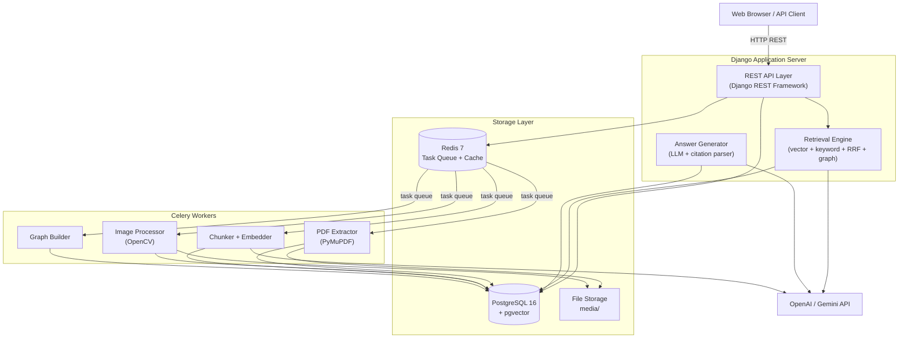
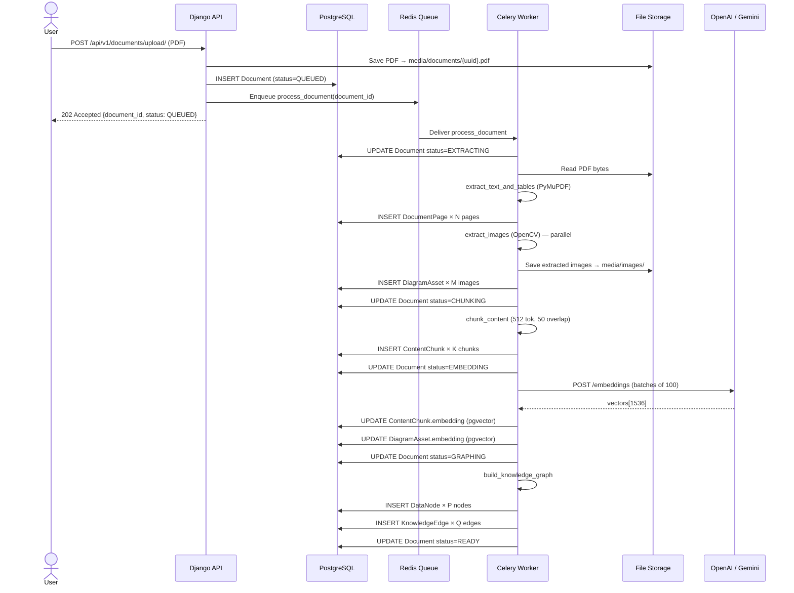
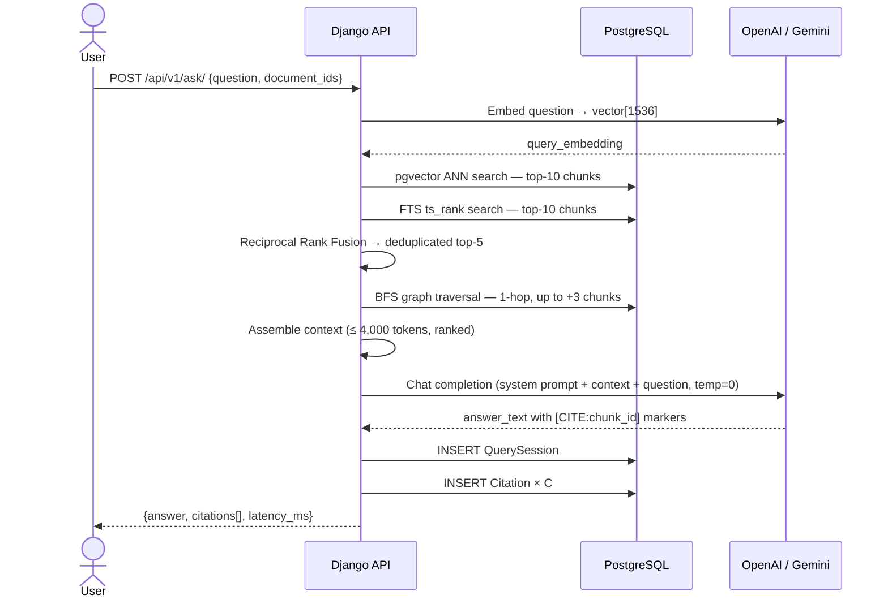
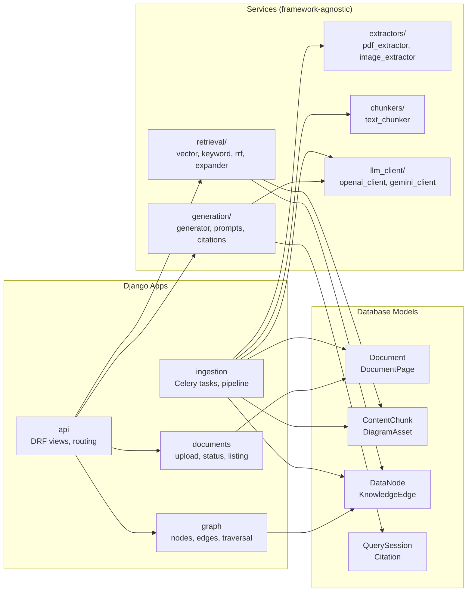
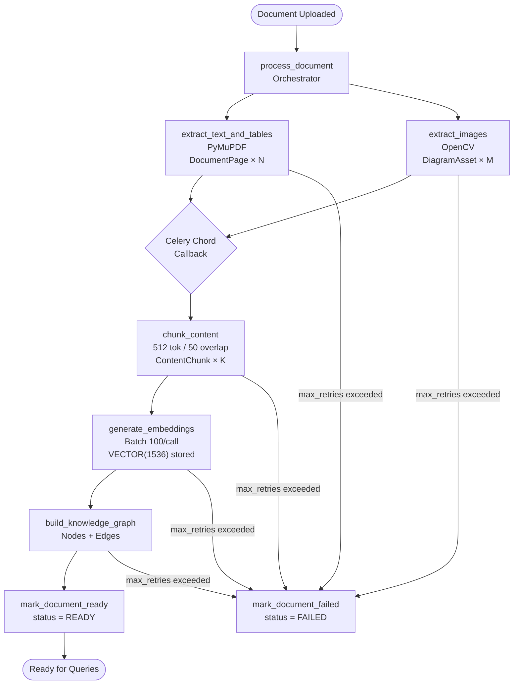
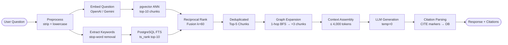

# SAGE — Architecture Blueprint
*Version 1.0 · Single Developer · Four-Week Timeline*

---

## 1. Executive Summary

SAGE (Standards and Analysis for Guided Engineering) is a multimodal GraphRAG system designed to answer natural-language questions about engineering documents with deterministic, verifiable citations.

The architecture reflects a deliberate bias toward **simplicity and reliability over sophistication**. Every component choice is justified against a four-week single-developer timeline and a primary success criterion of cited answers returned within ten seconds.

### Key Architectural Decisions

| Decision | Choice | Justification |
|---|---|---|
| Service topology | Django monolith | Eliminates distributed systems complexity; sufficient for MVP load |
| Graph store | PostgreSQL adjacency list | Eliminates Neo4j; pgvector already in stack |
| Async layer | Celery + Redis | Approved stack; well-understood operational model |
| Retrieval | Hybrid pgvector + FTS + RRF | Balances recall and precision; no cross-encoder needed for MVP |
| Embedding provider | OpenAI text-embedding-3-small | 1536 dimensions; cost-effective; high quality |
| LLM provider | GPT-4o-mini or Gemini 1.5 Flash | Fast, low-latency, cost-effective for citation-grounded answers |
| Frontend | Django templates + vanilla JS | Not the primary deliverable; saves 3–4 days |
| Image analysis | Caption + OCR text embedding | Full computer vision is out of scope; text-based embedding is sufficient |

**Primary success metric:** A user receives a correct, cited answer from an engineering document in under 10 seconds.

**Answered without citations = failure.** This is non-negotiable per ENGINEERING_STANDARDS.md.

---

## 2. Product Flow

```
PDF Upload (≤ 500 pages)
    ↓
Validate (MIME type, file size, page count)
    ↓
Store to media/documents/ + Create Document record (status = QUEUED)
    ↓
[Celery Worker picks up task]
    ↓
extract_text_and_tables  ──────────┐
    (PyMuPDF → DocumentPage)       │  Parallel
extract_images            ──────────┘  (Chord)
    (OpenCV → DiagramAsset)
    ↓
chunk_content
    (512 tokens, 50-token overlap → ContentChunk)
    ↓
generate_embeddings
    (Batch 100/call → VECTOR(1536) stored in pgvector)
    ↓
build_knowledge_graph
    (DataNode + KnowledgeEdge from structure, references, similarity)
    ↓
Document status → READY
    ─────────────────────────────────
[User asks a natural-language question]
    ↓
Preprocess query (strip, lowercase for keywords)
    ↓
Embed query (OpenAI/Gemini → VECTOR(1536))
    ↓
Vector search (pgvector ANN, top-10)
Keyword search (PostgreSQL FTS, top-10)       ← parallel
    ↓
Reciprocal Rank Fusion → deduplicated top-5 chunks
    ↓
Graph expansion (1-hop BFS → up to 3 additional chunks)
    ↓
Assemble context window (≤ 4,000 tokens, ranked order)
    ↓
LLM generates answer with inline [CITE:chunk_id] markers (temp = 0)
    ↓
Parse citations → write QuerySession + Citation records
    ↓
Return: { answer, citations[], latency_ms }
```

**Ingestion target:** Under 5 minutes for a 300-page document.
**Query target:** Under 10 seconds end-to-end.

---

## 3. System Architecture

### 3.1 High-Level Architecture



---

### 3.2 Upload and Ingestion Sequence



---

### 3.3 Query and Answer Sequence



---

### 3.4 Component Interaction Diagram



---

## 4. Directory Structure

```
sage/                                   # Repository root
├── docker-compose.yml                  # Multi-service orchestration
├── Dockerfile                          # Django application image
├── .env.example                        # Environment variable template (committed)
├── .env                                # Local secrets (gitignored)
├── requirements.txt                    # Pinned Python dependencies
├── manage.py                           # Django management entry point
│
├── config/                               # Django project configuration package
│   ├── __init__.py
│   ├── settings/
│   │   ├── __init__.py
│   │   ├── base.py                     # All shared settings; no secrets
│   │   ├── development.py              # DEBUG=True, local DB, console email
│   │   └── production.py              # DEBUG=False, gunicorn, strict headers
│   ├── urls.py                         # Root URL router → /api/v1/ + /admin/
│   ├── wsgi.py                         # WSGI entry point (gunicorn)
│   └── celery.py                       # Celery app instantiation + autodiscovery
│
├── apps/                               # All Django applications
│   ├── __init__.py
│   │
│   ├── documents/                      # Document lifecycle: upload → status → listing
│   │   ├── __init__.py
│   │   ├── models.py                   # Document, DocumentPage models
│   │   ├── serializers.py              # DRF serializers for Document
│   │   ├── views.py                    # Upload view, status view, list view
│   │   ├── urls.py                     # /documents/ routes
│   │   ├── validators.py               # File type, size, page count validation
│   │   ├── admin.py                    # Django admin registration
│   │   └── migrations/
│   │
│   ├── ingestion/                      # Async processing pipeline
│   │   ├── __init__.py
│   │   ├── tasks.py                    # Celery task definitions (all 7 tasks)
│   │   ├── pipeline.py                 # Orchestration logic called by tasks
│   │   └── migrations/                 # (no ingestion-specific models)
│   │
│   ├── chunks/                         # Chunk and diagram embedding models
│   │   ├── __init__.py
│   │   ├── models.py                   # ContentChunk, DiagramAsset models
│   │   ├── serializers.py
│   │   └── migrations/
│   │
│   ├── graph/                          # Knowledge graph layer
│   │   ├── __init__.py
│   │   ├── models.py                   # DataNode, KnowledgeEdge models
│   │   ├── builder.py                  # Graph construction service (4 edge types)
│   │   ├── traversal.py                # BFS 1-hop retrieval helper
│   │   ├── serializers.py
│   │   ├── views.py                    # /graph/nodes/, /graph/edges/ views
│   │   ├── urls.py
│   │   └── migrations/
│   │
│   ├── retrieval/                      # Hybrid retrieval pipeline
│   │   ├── __init__.py
│   │   ├── vector_search.py            # pgvector ANN query
│   │   ├── keyword_search.py           # PostgreSQL FTS ts_rank query
│   │   ├── rrf.py                      # Reciprocal Rank Fusion (k=60)
│   │   ├── expander.py                 # Graph-based context expansion
│   │   └── assembler.py                # Context window assembly (token budget)
│   │
│   ├── generation/                     # Answer generation layer
│   │   ├── __init__.py
│   │   ├── generator.py                # LLM call orchestration
│   │   ├── prompts.py                  # System + user prompt templates
│   │   └── citations.py                # [CITE:id] parser + Citation DB writer
│   │
│   └── api/                            # DRF views exposed over HTTP
│       ├── __init__.py
│       ├── views.py                    # SearchView, AskView, SessionCitationView
│       ├── serializers.py              # Search + Ask request/response schemas
│       └── urls.py                     # /api/v1/ route definitions
│
├── services/                           # Pure Python; zero Django coupling
│   ├── __init__.py
│   ├── extractors/
│   │   ├── __init__.py
│   │   ├── pdf_extractor.py            # PyMuPDF: text, page metadata
│   │   ├── image_extractor.py          # OpenCV: extract + preprocess images
│   │   └── table_extractor.py          # Serialize tables → plain text for MVP
│   ├── chunkers/
│   │   ├── __init__.py
│   │   └── text_chunker.py             # Fixed-size recursive splitter + section detection
│   └── llm_client/
│       ├── __init__.py
│       ├── base.py                     # Abstract interface: embed(), complete()
│       ├── openai_client.py            # OpenAI implementation
│       └── gemini_client.py            # Gemini implementation
│
├── tests/
│   ├── __init__.py
│   ├── conftest.py                     # Shared pytest fixtures (test DB, mock LLM)
│   ├── unit/
│   │   ├── test_pdf_extractor.py
│   │   ├── test_text_chunker.py
│   │   ├── test_vector_search.py
│   │   ├── test_keyword_search.py
│   │   ├── test_rrf.py
│   │   └── test_citation_parser.py
│   ├── integration/
│   │   ├── test_upload_pipeline.py     # Upload → READY full flow
│   │   └── test_query_pipeline.py      # Ask → cited answer full flow
│   └── evaluation/
│       ├── dataset.json                # 20 curated Q&A pairs
│       └── run_evaluation.py           # Accuracy + latency benchmark runner
│
├── media/                              # Runtime file storage (gitignored)
│   ├── documents/                      # Raw uploaded PDFs
│   └── images/                         # Extracted diagram assets (PNG)
│
├── infrastructure/
│   ├── nginx/
│   │   └── nginx.conf                  # Reverse proxy; static file serving
│   └── postgres/
│       └── init.sql                    # CREATE EXTENSION IF NOT EXISTS vector;
│
└── docs/
    ├── architecture.md                 # This document
    ├── api.md                          # API reference (auto-generated or manual)
    └── evaluation_report.md            # Week 4 evaluation results
```

### Directory Rationale

| Directory | Role |
|---|---|
| `sage/` | Django project config only; no business logic permitted here |
| `apps/` | Domain-bounded Django apps; each app owns its models, views, and URLs |
| `services/` | Framework-agnostic Python; independently testable without Django setup |
| `tests/unit/` | Fast tests; all external dependencies mocked |
| `tests/integration/` | Tests against a live test database; Celery tasks run synchronously |
| `tests/evaluation/` | Accuracy and latency benchmarks against the curated 20-question dataset |
| `infrastructure/` | Container and server configuration; no Python |
| `media/` | Runtime file storage; never committed to version control |

---

## 5. Database Design

All tables use UUID primary keys generated by PostgreSQL `gen_random_uuid()`. All timestamp fields are `TIMESTAMP WITH TIME ZONE`.

---

### 5.1 Document

**Purpose:** Tracks a PDF from upload through every ingestion stage to completion.

| Field | Type | Notes |
|---|---|---|
| `id` | UUID PK | |
| `name` | VARCHAR(255) | User-supplied or derived from filename |
| `original_filename` | VARCHAR(255) | Original upload filename |
| `file_path` | VARCHAR(500) | Relative path within media/documents/ |
| `file_size_bytes` | BIGINT | |
| `mime_type` | VARCHAR(100) | Validated as application/pdf |
| `status` | VARCHAR(50) | PENDING → QUEUED → EXTRACTING → CHUNKING → EMBEDDING → GRAPHING → READY / FAILED |
| `page_count` | INT | Populated after extraction; nullable |
| `error_message` | TEXT | Set on FAILED; nullable |
| `created_at` | TIMESTAMPTZ | |
| `updated_at` | TIMESTAMPTZ | Auto-updated on every save |

**Indexes:** `status`, `created_at DESC`
**Constraint:** `status IN ('PENDING','QUEUED','EXTRACTING','CHUNKING','EMBEDDING','GRAPHING','READY','FAILED')`

---

### 5.2 DocumentPage

**Purpose:** Per-page extracted text. Enables page-level full-text search and provides the page number anchor for all citations.

| Field | Type | Notes |
|---|---|---|
| `id` | UUID PK | |
| `document_id` | UUID FK → Document | ON DELETE CASCADE |
| `page_number` | INT | 1-indexed |
| `raw_text` | TEXT | Full page text extracted by PyMuPDF |
| `text_search_vector` | TSVECTOR | Populated by DB trigger; used for FTS |
| `has_images` | BOOLEAN | True if page contains ≥ 1 extracted DiagramAsset |
| `has_tables` | BOOLEAN | True if page contains ≥ 1 detected table |
| `created_at` | TIMESTAMPTZ | |

**Indexes:** `UNIQUE (document_id, page_number)`, `GIN (text_search_vector)`
**Trigger:** `BEFORE INSERT OR UPDATE` → `text_search_vector = to_tsvector('english', raw_text)`

---

### 5.3 ContentChunk

**Purpose:** Core retrieval unit. Every chunk is a semantically meaningful text slice with a vector embedding for similarity search.

| Field | Type | Notes |
|---|---|---|
| `id` | UUID PK | |
| `document_id` | UUID FK → Document | ON DELETE CASCADE |
| `page_id` | UUID FK → DocumentPage | |
| `chunk_index` | INT | Monotonically increasing per document (0-based) |
| `chunk_text` | TEXT | ≤ 512 tokens |
| `chunk_type` | VARCHAR(50) | `text`, `table`, `caption`, `heading` |
| `section_identifier` | VARCHAR(255) | e.g. "4.3.2"; nullable if undetectable |
| `token_count` | INT | Actual token count of chunk_text |
| `embedding` | VECTOR(1536) | **pgvector**; NULL until generate_embeddings completes |
| `text_search_vector` | TSVECTOR | GIN indexed |
| `created_at` | TIMESTAMPTZ | |

**Indexes:**
- `(document_id, chunk_index)` — ordered document scan
- `IVFFlat (embedding vector_cosine_ops, lists=100)` — ANN vector search
- `GIN (text_search_vector)` — keyword search
- `section_identifier` — graph node lookup

**pgvector field:** `embedding VECTOR(1536)`

---

### 5.4 DiagramAsset

**Purpose:** Stores extracted images (diagrams, schematics, figures) with embeddings derived from caption and OCR text.

| Field | Type | Notes |
|---|---|---|
| `id` | UUID PK | |
| `document_id` | UUID FK → Document | ON DELETE CASCADE |
| `page_id` | UUID FK → DocumentPage | |
| `image_path` | VARCHAR(500) | Relative path within media/images/ |
| `image_format` | VARCHAR(20) | Always PNG (converted on extraction) |
| `width_px` | INT | |
| `height_px` | INT | |
| `caption` | TEXT | Nearest text identified as a figure caption; nullable |
| `ocr_text` | TEXT | Text detected inside the image by PyMuPDF; nullable |
| `embedding` | VECTOR(1536) | **pgvector**; embedding of `caption + ocr_text`; nullable if no text |
| `bounding_box` | JSONB | `{x, y, width, height}` in PDF points |
| `created_at` | TIMESTAMPTZ | |

**Indexes:** `document_id`, `IVFFlat (embedding) WHERE embedding IS NOT NULL`

**pgvector field:** `embedding VECTOR(1536)`

---

### 5.5 DataNode

**Purpose:** A node in the knowledge graph. Represents a logical entity extracted from the document.

| Field | Type | Notes |
|---|---|---|
| `id` | UUID PK | |
| `document_id` | UUID FK → Document | ON DELETE CASCADE |
| `node_type` | VARCHAR(50) | `CLAUSE`, `SECTION`, `TABLE`, `DIAGRAM`, `REQUIREMENT`, `EXCEPTION` |
| `label` | VARCHAR(500) | Human-readable, e.g. "Section 4.3.2 — Tensile Strength" |
| `content_chunk_id` | UUID FK → ContentChunk | Nullable; the chunk this node represents |
| `diagram_asset_id` | UUID FK → DiagramAsset | Nullable; set for DIAGRAM nodes |
| `page_number` | INT | |
| `section_identifier` | VARCHAR(255) | Normalized, e.g. "4.3.2" |
| `properties` | JSONB | Flexible metadata (keywords, aliases, matched phrases) |
| `created_at` | TIMESTAMPTZ | |

**Indexes:** `(document_id, node_type)`, `section_identifier`, `content_chunk_id`
**Constraint:** `CHECK (content_chunk_id IS NOT NULL OR diagram_asset_id IS NOT NULL)` — every node must link to content

---

### 5.6 KnowledgeEdge

**Purpose:** A directed relationship between two DataNodes in the knowledge graph.

| Field | Type | Notes |
|---|---|---|
| `id` | UUID PK | |
| `source_node_id` | UUID FK → DataNode | ON DELETE CASCADE |
| `target_node_id` | UUID FK → DataNode | ON DELETE CASCADE |
| `edge_type` | VARCHAR(50) | `REFERENCES`, `OVERRIDES`, `RELATED_TO`, `DESCRIBES`, `CONTAINS`, `SUPERSEDES` |
| `weight` | FLOAT | Default 1.0; OVERRIDES/SUPERSEDES use 1.5 |
| `evidence` | TEXT | The text span that triggered this edge; nullable |
| `properties` | JSONB | |
| `created_at` | TIMESTAMPTZ | |

**Indexes:** `(source_node_id, edge_type)`, `(target_node_id, edge_type)` — both directions for BFS
**Constraint:** `CHECK (source_node_id <> target_node_id)` — no self-loops

---

### 5.7 QuerySession

**Purpose:** Audit record for every question-answer interaction. Used for evaluation, latency analysis, and session retrieval.

| Field | Type | Notes |
|---|---|---|
| `id` | UUID PK | |
| `query_text` | TEXT | |
| `query_embedding` | VECTOR(1536) | **pgvector**; stored for future semantic session search |
| `answer_text` | TEXT | Final LLM answer |
| `retrieved_chunk_ids` | UUID[] | PostgreSQL array of ContentChunk IDs (RRF top-5) |
| `graph_expanded_node_ids` | UUID[] | DataNode IDs added by graph expansion |
| `retrieval_method` | VARCHAR(50) | `hybrid`, `vector_only`, `keyword_only` |
| `latency_ms` | INT | Total wall-clock API response time |
| `token_count_input` | INT | LLM prompt tokens |
| `token_count_output` | INT | LLM completion tokens |
| `created_at` | TIMESTAMPTZ | |

**Indexes:** `created_at DESC`

**pgvector field:** `query_embedding VECTOR(1536)`

---

### 5.8 Citation

**Purpose:** Individual citation record. One QuerySession has one or more Citations. Every answer that passes the acceptance criteria has at least one.

| Field | Type | Notes |
|---|---|---|
| `id` | UUID PK | |
| `session_id` | UUID FK → QuerySession | ON DELETE CASCADE |
| `chunk_id` | UUID FK → ContentChunk | Nullable |
| `diagram_id` | UUID FK → DiagramAsset | Nullable |
| `document_id` | UUID FK → Document | Denormalized for query speed |
| `document_name` | VARCHAR(255) | Denormalized for display without JOIN |
| `page_number` | INT | |
| `section_identifier` | VARCHAR(255) | Nullable |
| `excerpt` | TEXT | The specific text span supporting the answer |
| `confidence_score` | FLOAT | 0.0–1.0; derived from retrieval score |
| `retrieval_method` | VARCHAR(50) | `vector`, `keyword`, `graph` |
| `rank_position` | INT | 1-indexed position in final results |
| `created_at` | TIMESTAMPTZ | |

**Indexes:** `session_id`, `document_id`
**Constraint:** `CHECK (chunk_id IS NOT NULL OR diagram_id IS NOT NULL)`

---

### 5.9 Index Summary

| Table | Index Type | Column(s) | Purpose |
|---|---|---|---|
| DocumentPage | GIN | text_search_vector | Page-level FTS |
| ContentChunk | IVFFlat (lists=100) | embedding | ANN vector search |
| ContentChunk | GIN | text_search_vector | Chunk-level FTS |
| DiagramAsset | IVFFlat (partial) | embedding | Diagram similarity |
| KnowledgeEdge | BTree | (source_node_id, edge_type) | Forward graph traversal |
| KnowledgeEdge | BTree | (target_node_id, edge_type) | Reverse graph traversal |
| QuerySession | BTree | created_at DESC | Session history |

**IVFFlat tuning:** Use `SET ivfflat.probes = 10` per session for better recall at acceptable speed. For collections under 100K vectors, this retrieves 98%+ of nearest neighbors.

---

## 6. API Design

### 6.1 Authentication

All endpoints require `Authorization: Token <token>`. DRF's built-in `TokenAuthentication` is used. A management command `create_dev_token` provisions tokens during development. JWT is post-MVP.

**Base URL:** `/api/v1/`

---

### 6.2 Endpoints

#### POST /api/v1/documents/upload/

Upload a PDF document and queue it for ingestion.

**Request:** `multipart/form-data`

| Field | Type | Required |
|---|---|---|
| `file` | Binary (PDF) | Yes |
| `name` | String | No — defaults to original filename |

**Response 202:**
```json
{
  "document_id": "3fa85f64-5717-4562-b3fc-2c963f66afa6",
  "name": "RDSO_Spec_2024.pdf",
  "status": "QUEUED",
  "created_at": "2024-01-15T10:30:00Z"
}
```

**Error 400 (invalid file):**
```json
{
  "error": "Unsupported file type. Only PDF files are accepted.",
  "code": "INVALID_FILE_TYPE"
}
```

---

#### GET /api/v1/documents/{document_id}/status/

Poll ingestion status. Clients poll every 5 seconds until status is `READY` or `FAILED`.

**Response 200:**
```json
{
  "document_id": "3fa85f64-5717-4562-b3fc-2c963f66afa6",
  "name": "RDSO_Spec_2024.pdf",
  "status": "READY",
  "page_count": 247,
  "chunk_count": 891,
  "node_count": 312,
  "edge_count": 489,
  "error_message": null,
  "created_at": "2024-01-15T10:30:00Z",
  "updated_at": "2024-01-15T10:34:22Z"
}
```

---

#### GET /api/v1/documents/

List all uploaded documents. Paginated (20 per page).

**Response 200:**
```json
{
  "count": 5,
  "next": null,
  "previous": null,
  "results": [
    {
      "document_id": "3fa85f64-...",
      "name": "RDSO_Spec_2024.pdf",
      "status": "READY",
      "page_count": 247,
      "created_at": "2024-01-15T10:30:00Z"
    }
  ]
}
```

---

#### POST /api/v1/search/

Hybrid semantic + keyword search. Returns ranked chunks without LLM generation. Used for debugging and exploration.

**Request:**
```json
{
  "query": "tensile strength requirements for rail joints",
  "document_ids": ["3fa85f64-5717-4562-b3fc-2c963f66afa6"],
  "top_k": 5,
  "search_mode": "hybrid"
}
```

| Field | Default | Options |
|---|---|---|
| `document_ids` | All READY documents | Filter by specific IDs |
| `top_k` | 5 | 1–10 |
| `search_mode` | `hybrid` | `hybrid`, `vector`, `keyword` |

**Response 200:**
```json
{
  "query": "tensile strength requirements for rail joints",
  "results": [
    {
      "chunk_id": "b2d4f891-...",
      "document_name": "RDSO_Spec_2024.pdf",
      "document_id": "3fa85f64-...",
      "page_number": 42,
      "section_identifier": "Section 4.3.2",
      "chunk_type": "text",
      "chunk_text": "The tensile strength of fish plate joints shall not be less than 720 MPa...",
      "score": 0.923,
      "retrieval_method": "vector"
    }
  ],
  "total": 5,
  "latency_ms": 420
}
```

---

#### POST /api/v1/ask/

Full GraphRAG Q&A with citations. This is the primary product endpoint.

**Request:**
```json
{
  "question": "What is the minimum tensile strength for rail joints?",
  "document_ids": ["3fa85f64-5717-4562-b3fc-2c963f66afa6"]
}
```

**Response 200:**
```json
{
  "session_id": "9b1deb4d-3b7d-4bad-9bdd-2b0d7b3dcb6d",
  "question": "What is the minimum tensile strength for rail joints?",
  "answer": "Per Section 4.3.2 of RDSO Spec 2024, the minimum tensile strength for fish plate rail joints is 720 MPa at ambient temperature [CITE:b2d4f891-...]. Section 4.3.4 further specifies that for curved tracks exceeding 5 degrees, this requirement increases to 750 MPa [CITE:c3e5a012-...].",
  "citations": [
    {
      "citation_id": "uuid",
      "document_name": "RDSO_Spec_2024.pdf",
      "document_id": "3fa85f64-...",
      "page_number": 42,
      "section_identifier": "Section 4.3.2",
      "chunk_id": "b2d4f891-...",
      "excerpt": "The tensile strength of fish plate joints shall not be less than 720 MPa at ambient temperature (23°C ± 2°C).",
      "confidence_score": 0.92,
      "retrieval_method": "vector",
      "rank_position": 1
    },
    {
      "citation_id": "uuid",
      "document_name": "RDSO_Spec_2024.pdf",
      "document_id": "3fa85f64-...",
      "page_number": 45,
      "section_identifier": "Section 4.3.4",
      "chunk_id": "c3e5a012-...",
      "excerpt": "For curved tracks exceeding 5 degrees of curvature, the minimum tensile strength shall be 750 MPa.",
      "confidence_score": 0.78,
      "retrieval_method": "graph",
      "rank_position": 2
    }
  ],
  "latency_ms": 3420,
  "created_at": "2024-01-15T10:35:00Z"
}
```

**Error 422 (no READY documents):**
```json
{
  "error": "No documents are available for querying. Upload and fully process a document first.",
  "code": "NO_READY_DOCUMENTS"
}
```

---

#### GET /api/v1/sessions/{session_id}/citations/

Retrieve full citation detail for a past session. Used for audit and verification.

**Response 200:** Returns `session_id`, `question`, `answer`, and the full `citations` array (same schema as `/ask/`).

---

#### GET /api/v1/graph/nodes/

Retrieve knowledge graph nodes for visualization.

**Query params:** `document_id` (required), `node_type` (optional), `page` (pagination)

**Response 200:**
```json
{
  "document_id": "3fa85f64-...",
  "nodes": [
    {
      "node_id": "uuid",
      "node_type": "CLAUSE",
      "label": "Section 4.3.2 — Tensile Strength",
      "page_number": 42,
      "section_identifier": "4.3.2"
    }
  ],
  "total": 312
}
```

---

#### GET /api/v1/graph/edges/

Retrieve knowledge graph edges for visualization.

**Query params:** `document_id` (required)

**Response 200:**
```json
{
  "document_id": "3fa85f64-...",
  "edges": [
    {
      "edge_id": "uuid",
      "source_node_id": "uuid",
      "source_label": "Section 4.3.2",
      "target_node_id": "uuid",
      "target_label": "Section 4.3.4",
      "edge_type": "REFERENCES",
      "weight": 1.0,
      "evidence": "As further specified in Section 4.3.4 for curved tracks..."
    }
  ],
  "total": 489
}
```

---

## 7. Celery Workflow

### 7.1 Task Definitions

| Task | Input | Output | Retries | Timeout |
|---|---|---|---|---|
| `process_document` | `document_id` | Orchestrates chord | 0 | 600s |
| `extract_text_and_tables` | `document_id` | DocumentPage records | 3 | 300s |
| `extract_images` | `document_id` | DiagramAsset records | 3 | 300s |
| `chunk_content` | `document_id` | ContentChunk records | 3 | 120s |
| `generate_embeddings` | `document_id` | Updates embeddings | 5 | 300s |
| `build_knowledge_graph` | `document_id` | DataNode + KnowledgeEdge | 3 | 180s |
| `mark_document_failed` | `document_id`, `error: str` | Updates Document.status | 0 | 10s |

### 7.2 Workflow Diagram



### 7.3 Retry Strategy

All tasks use exponential backoff: `countdown = 2 ** retry_number * 30` seconds (30s → 60s → 120s).

`generate_embeddings` uses 5 retries specifically to handle API rate limiting from OpenAI/Gemini. All other tasks use 3 retries.

### 7.4 Failure Handling

- Every task wraps its logic in `try/except` and calls `mark_document_failed` after exhausting retries.
- `Document.error_message` stores a human-readable failure description.
- The `/status/` endpoint exposes `error_message` so users can understand what failed.
- A management command `requeue_document <document_id>` resets status to QUEUED and re-enqueues the task for manual recovery.
- Celery Flower is included in Docker Compose for task monitoring.

---

## 8. Knowledge Graph Design

### 8.1 Node Types

| Node Type | Description | Source |
|---|---|---|
| `SECTION` | Top-level document division (e.g. "Chapter 4", "Part III") | Document structure + heading detection |
| `CLAUSE` | Numbered clause or sub-clause (e.g. "4.3.2") | Section heading detection by regex |
| `REQUIREMENT` | Mandatory specification containing "shall" or "must" | Pattern match within chunk text |
| `EXCEPTION` | Conditional override ("except where", "unless", "provided that") | Pattern match |
| `TABLE` | Tabular data extracted from a page | Table detection during PDF extraction |
| `DIAGRAM` | An extracted image asset | Existence of DiagramAsset record |

### 8.2 Edge Types

| Edge Type | Direction | Trigger | Weight |
|---|---|---|---|
| `CONTAINS` | SECTION → CLAUSE | Clause `section_identifier` is a child of Section identifier | 1.0 |
| `REFERENCES` | CLAUSE → CLAUSE | Text contains "see Section X", "refer to Clause Y" | 1.0 |
| `OVERRIDES` | CLAUSE → CLAUSE | Text contains "takes precedence over Clause X" | 1.5 |
| `SUPERSEDES` | CLAUSE → CLAUSE | Text contains "supersedes Clause X", "replaces Clause X" | 1.5 |
| `DESCRIBES` | DIAGRAM → CLAUSE | Figure caption contains a clause or section number | 1.0 |
| `RELATED_TO` | CHUNK ↔ CHUNK | Cosine similarity > 0.85 between embeddings (symmetric) | 0.5 |

### 8.3 Construction Rules

`build_knowledge_graph` executes four sequential steps after embeddings are generated:

**Step 1 — CONTAINS (structural)**
Iterate all DataNodes with section identifiers. If Node B's identifier is a numeric child of Node A's (e.g. "4.3" is a child of "4"), create `A CONTAINS B`. This reconstructs document hierarchy from the identifier structure.

**Step 2 — REFERENCES, OVERRIDES, SUPERSEDES (textual)**
For each ContentChunk, scan chunk_text with these regex patterns:

```
see [Cc]lause ([\d.]+)           → REFERENCES
refer to [Ss]ection ([\d.]+)     → REFERENCES
[Ss]ection ([\d.]+) applies      → REFERENCES
takes precedence over [Cc]lause ([\d.]+) → OVERRIDES
overrides [Cc]lause ([\d.]+)     → OVERRIDES
supersedes [Cc]lause ([\d.]+)    → SUPERSEDES
replaces [Cc]lause ([\d.]+)      → SUPERSEDES
```

Resolve the matched identifier to a DataNode via `section_identifier` lookup. Create edge with `evidence = matched sentence`.

**Step 3 — DESCRIBES (diagram-to-clause)**
For each DiagramAsset with a non-empty caption, scan for clause/section numbers via `[\d]+\.[\d.]+`. Resolve matched identifiers to DataNodes and create `DIAGRAM DESCRIBES CLAUSE` edges.

**Step 4 — RELATED_TO (semantic)**
For all pairs of CLAUSE and REQUIREMENT DataNodes within the same document, if `1 - (embedding <=> other_embedding) > 0.85`, create a symmetric `RELATED_TO` edge. Use a single SQL query with pgvector's `<=>` operator rather than Python iteration to keep this tractable.

### 8.4 Graph Traversal at Retrieval Time

After RRF produces the top-5 chunks:
1. Retrieve their corresponding DataNodes.
2. Execute a single SQL query fetching all 1-hop neighbors connected by `REFERENCES`, `OVERRIDES`, `SUPERSEDES`, or `DESCRIBES` edges (not `RELATED_TO` — too noisy for expansion).
3. Load ContentChunks for those neighbor nodes.
4. Add up to 3 additional chunks to the context window, ordered by edge weight descending, subject to the 4,000-token budget.
5. Mark these as `retrieval_method: "graph"` in citations.

**BFS depth is capped at 1 hop for MVP.** Deeper traversal introduces noise and latency without demonstrated benefit at this scale.

---

## 9. Retrieval Pipeline

### 9.1 Pipeline Overview



### 9.2 Detailed Steps

**Step 1 — Query Preprocessing**
Strip leading/trailing whitespace. Preserve original casing for embedding. Apply stop-word removal only for keyword extraction (not for embedding).

**Step 2 — Query Embedding**
Call the configured embedding provider with the original query string. Cache the resulting vector in `QuerySession.query_embedding` for audit purposes.

**Step 3 — Vector Search**
Execute pgvector ANN query against `ContentChunk.embedding`:
```sql
SELECT id, chunk_text, section_identifier, page_number,
       1 - (embedding <=> %(query_vector)s) AS score
FROM chunks_contentchunk
WHERE document_id = ANY(%(document_ids)s)
  AND embedding IS NOT NULL
ORDER BY embedding <=> %(query_vector)s
LIMIT 10;
```
Session-level: `SET LOCAL ivfflat.probes = 10;`

**Step 4 — Keyword Search**
Execute PostgreSQL FTS query:
```sql
SELECT id, chunk_text, section_identifier, page_number,
       ts_rank(text_search_vector, plainto_tsquery('english', %(query)s)) AS score
FROM chunks_contentchunk
WHERE document_id = ANY(%(document_ids)s)
  AND text_search_vector @@ plainto_tsquery('english', %(query)s)
ORDER BY score DESC
LIMIT 10;
```

**Step 5 — Reciprocal Rank Fusion**
For each candidate chunk from either retrieval method:
```
RRF(chunk) = 1/(60 + rank_vector) + 1/(60 + rank_keyword)
```
A chunk absent from one method receives `rank = 1001` (absence penalty). Sort by RRF score descending, deduplicate, take top 5.

**Step 6 — Graph Expansion**
Look up DataNodes for the top-5 chunks. Fetch 1-hop neighbors via KnowledgeEdge (REFERENCES, OVERRIDES, SUPERSEDES, DESCRIBES only). Retrieve ContentChunks for neighbors not already in top-5. Add up to 3 additional chunks, ordered by edge weight descending.

**Step 7 — Context Assembly**
Build the context string in ranked order. Each chunk formatted as:
```
[CHUNK_ID: {id}]
Source: {document_name} | Page {page_number} | {section_identifier}
{chunk_text}
---
```
Stop appending chunks when cumulative token count exceeds 4,000.

**Step 8 — Answer Generation**
Send to LLM: `system_prompt + assembled_context + user_question`. Temperature = 0.0 for deterministic output. The system prompt instructs the model to insert `[CITE:{chunk_id}]` markers inline.

**Step 9 — Citation Parsing**
Extract all `[CITE:{chunk_id}]` patterns from the answer text. Validate each chunk_id exists in the database. Hydrate full citation metadata. Discard and log any hallucinated IDs. Write Citation records to the database.

### 9.3 Default Parameters

| Parameter | Value | Rationale |
|---|---|---|
| `top_k` | 5 | Balances context richness and token budget |
| `rrf_k` | 60 | Standard constant; reduces impact of top-1 domination |
| `ivfflat.probes` | 10 | ~98% recall for collections < 100K vectors |
| `graph_expansion_hops` | 1 | Reliable and fast; deeper traversal adds noise |
| `graph_max_additions` | 3 | Keeps context focused |
| `context_token_budget` | 4,000 | Leaves room for system prompt + answer in LLM window |
| `embedding_model` | text-embedding-3-small | Configurable via `EMBEDDING_MODEL` env var |
| `generation_model` | gpt-4o-mini | Configurable via `LLM_MODEL` env var |
| `temperature` | 0.0 | Deterministic output required |

---

## 10. Citation Standards

### 10.1 Requirements

Every answer must include at least one citation. An answer returned without a citation is a system failure, not a partial success.

Every citation must carry:
- Document name (human-readable)
- Page number (1-indexed)
- Section identifier (nullable only if the document has no discernible section structure)
- Chunk ID (internal; for audit)
- Text excerpt (the specific text span supporting the answer)
- Confidence score (0.0–1.0)
- Retrieval method (`vector`, `keyword`, or `graph`)

### 10.2 System Prompt (Citation Instructions)

```
You are an engineering document assistant. Answer the user's question using only the provided context chunks.

Rules:
1. For every factual claim, insert [CITE:{chunk_id}] immediately after the claim.
   Example: "The minimum tensile strength is 720 MPa [CITE:b2d4f891-3b7d-4bad-9bdd-2b0d7b3dcb6d]."
2. Use only the chunk_ids provided in the context. Do not invent chunk_ids.
3. If the context does not contain sufficient information, respond exactly:
   "The provided documents do not contain sufficient information to answer this question."
4. Do not speculate beyond the documents. Do not add general engineering knowledge.
5. Multiple citations per sentence are permitted.
```

### 10.3 Confidence Score Mapping

| Retrieval Method | Score Derivation | Typical Range |
|---|---|---|
| `vector` | `1 - cosine_distance` from pgvector | 0.70–0.99 |
| `keyword` | `ts_rank` normalized to 0–1 | 0.40–0.85 |
| `graph` | Source chunk score × edge weight | 0.50–0.80 |

### 10.4 Example Citation Object

```json
{
  "citation_id": "c7f3a2e1-1234-5678-abcd-ef0123456789",
  "document_name": "RDSO_Spec_T-2024.pdf",
  "document_id": "3fa85f64-5717-4562-b3fc-2c963f66afa6",
  "page_number": 42,
  "section_identifier": "Section 4.3.2",
  "chunk_id": "b2d4f891-3b7d-4bad-9bdd-2b0d7b3dcb6d",
  "excerpt": "The tensile strength of fish plate joints shall not be less than 720 MPa at ambient temperature (23°C ± 2°C).",
  "confidence_score": 0.92,
  "retrieval_method": "vector",
  "rank_position": 1
}
```

---

## 11. Evaluation Framework

### 11.1 Dataset Creation

1. Select one representative RDSO specification (200–300 pages) as the evaluation document.
2. Manually read 10 sections covering varied content types: numbered clauses, cross-references, exception clauses, tables, figures, and definition lists.
3. For each section, author 2 questions: one factual lookup and one requiring cross-referencing.
4. Record ground-truth answers with exact source locations (page number + section identifier).
5. Store as `tests/evaluation/dataset.json`.

**Format:**
```json
[
  {
    "id": "Q001",
    "question": "What is the minimum tensile strength for fish plate joints?",
    "expected_answer_contains": "720 MPa",
    "expected_source_page": 42,
    "expected_section": "4.3.2",
    "query_type": "factual_lookup"
  }
]
```

### 11.2 Sample Evaluation Questions

| ID | Query Type | Example |
|---|---|---|
| Q001 | Factual lookup | "What is the minimum tensile strength for fish plate joints?" |
| Q002 | Cross-reference | "Which clause overrides Section 3.1 for curved tracks?" |
| Q003 | Diagram lookup | "Which figure illustrates the overhead clearance envelope?" |
| Q004 | Exception | "What are the exceptions to the standard track gauge requirement?" |
| Q005 | Table lookup | "What are the permissible axle load limits in Table 2?" |
| Q006 | Applicability | "Does Section 5.4 apply to broad gauge lines?" |
| Q007 | Definition | "How is 'formation width' defined in this specification?" |
| Q008 | Requirement list | "List all mandatory requirements in Section 6." |
| Q009 | Conflict | "Are there conflicting requirements between Section 4 and Section 7?" |
| Q010 | Diagram-to-clause | "Which clauses are illustrated by Figure 3.2?" |
| Q011–Q020 | Mixed types | Additional coverage of sections 7–10 |

### 11.3 Metrics

| Metric | Definition | Target |
|---|---|---|
| **Citation Presence** | % of answers with ≥ 1 citation | 100% |
| **Citation Accuracy** | % where cited page + section is correct (manual review) | ≥ 80% |
| **Answer Correctness** | % of answers judged factually correct (manual review) | ≥ 80% |
| **Hallucination Rate** | % of citations referencing non-existent chunks | 0% |
| **Median Latency** | Wall-clock time per query | < 5 seconds |
| **P95 Latency** | 95th percentile query time | < 10 seconds |

### 11.4 Evaluation Runner

`tests/evaluation/run_evaluation.py`:
1. Load `dataset.json`.
2. For each question, call `POST /api/v1/ask/` and record answer, citations, and latency.
3. Auto-check: citation presence, latency, hallucination rate (chunk_id validation).
4. Output a review sheet (CSV) for manual scoring of answer correctness and citation accuracy.
5. Print summary report.

### 11.5 Failure Analysis Process

For each failed question, classify by root cause:

| Root Cause Code | Diagnosis | Remedy |
|---|---|---|
| `RETRIEVAL_MISS` | Correct chunk not in top-5 | Adjust chunking boundaries; tune `ivfflat.probes` |
| `CONTEXT_ASSEMBLY` | Correct chunk retrieved but not cited | Inspect context window; may be truncated by token budget |
| `HALLUCINATION` | LLM modified or invented a citation | Tighten system prompt; add few-shot examples |
| `CHUNKING` | Answer spans a chunk boundary | Adjust overlap or chunk size |
| `GRAPH_MISS` | Cross-reference answer not found by graph | Review regex patterns; check edge construction for this section |

---

## 12. Four-Week Implementation Plan

### Week 1 — Foundation and Document Ingestion (Days 1–7)

**Goal:** A PDF can be uploaded, extracted, chunked, and stored. No embeddings yet.

| Day | Deliverable |
|---|---|
| 1–2 | Docker Compose: PostgreSQL (pgvector extension), Redis, Django, Celery worker, Flower. All services start clean. Migrations run. `/admin/` accessible. |
| 3 | `Document` model + upload API + `/status/` endpoint. File saved to `media/documents/`. Status cycles PENDING → QUEUED (stub). |
| 4–5 | PyMuPDF extraction: `DocumentPage` records created with `raw_text`, `has_images`, `has_tables`. OpenCV image extraction: `DiagramAsset` records created, images saved to `media/images/`. |
| 6 | Text chunking: `ContentChunk` records created (512 tokens, 50 overlap). Section identifier regex. `chunk_type` classification. |
| 7 | Celery chord orchestration: `extract_text_and_tables` ∥ `extract_images` → `chunk_content` → status transitions working end-to-end. Failure handler tested. |

**Acceptance Criteria:**
- Upload a 100-page PDF → all DocumentPage + ContentChunk records populated in database.
- Extraction completes within 2 minutes for 100 pages.
- Celery task states visible in Flower.
- All Django admin pages functional.
- No hard-coded secrets in any committed file.

**Risks:**
- Section identifier extraction may be inaccurate for non-standard heading formats. Mitigation: fall back to `Page {N}` if no heading detected.
- PyMuPDF table extraction quality varies by PDF structure. Mitigation: serialize tables as plain text for MVP; structured table extraction is post-MVP.

---

### Week 2 — Embeddings and Basic Retrieval (Days 8–14)

**Goal:** A question can be asked and receives a cited answer. No knowledge graph yet.

| Day | Deliverable |
|---|---|
| 8–9 | LLM client abstraction (`base.py`, `openai_client.py`, `gemini_client.py`). Batch embedding generation (100 per API call). `ContentChunk.embedding` and `DiagramAsset.embedding` populated. |
| 10 | pgvector IVFFlat index created. Vector search query (`vector_search.py`) implemented and tested with raw SQL. |
| 11 | PostgreSQL FTS index + tsvector trigger deployed. Keyword search query (`keyword_search.py`) implemented. |
| 12 | Reciprocal Rank Fusion (`rrf.py`). `QuerySession` model. `POST /api/v1/search/` working. |
| 13 | Answer generation: system prompt, context assembly (`assembler.py`), LLM call (`generator.py`). Citation `[CITE:chunk_id]` marker protocol established. |
| 14 | Citation parsing (`citations.py`). `Citation` model + DB writes. `POST /api/v1/ask/` end-to-end working. |

**Acceptance Criteria:**
- Ask a question → receive answer with ≥ 1 citation within 10 seconds.
- Citation includes document name, page number, section identifier, excerpt.
- `QuerySession` + `Citation` records written to database.
- `/api/v1/search/` returns ranked results with RRF scores.

**Risks:**
- Embedding API costs accumulate rapidly during development. Mitigation: use a 20-page test document during development; reserve full-document ingestion for evaluation.
- LLM may not reliably insert `[CITE:chunk_id]` markers. Mitigation: include 2 few-shot examples in the system prompt.

---

### Week 3 — Knowledge Graph and Enhancement (Days 15–21)

**Goal:** Knowledge graph built, graph-expanded retrieval working, evaluation dataset ready.

| Day | Deliverable |
|---|---|
| 15–16 | `DataNode` + `KnowledgeEdge` models + migrations. Graph builder service: CONTAINS and REFERENCES edges implemented and populated for a test document. |
| 17 | OVERRIDES, SUPERSEDES, DESCRIBES edge types. `build_knowledge_graph` Celery task integrated into the pipeline. Status transitions to GRAPHING. |
| 18 | RELATED_TO edges from pgvector similarity (SQL-based). 1-hop BFS traversal (`traversal.py`) implemented. |
| 19 | Graph-expanded retrieval integrated into `/api/v1/ask/`. Graph API endpoints (`/graph/nodes/`, `/graph/edges/`) working. |
| 20 | Evaluation dataset: 20 Q&A pairs authored in `tests/evaluation/dataset.json`. Evaluation runner script (`run_evaluation.py`) complete. |
| 21 | Prompt refinement based on first evaluation run. Unit tests for `vector_search`, `keyword_search`, `rrf`, `citation_parser`. |

**Acceptance Criteria:**
- Graph has ≥ 50 nodes and ≥ 30 edges for a 100-page test document.
- At least 3 answers demonstrably include graph-expanded citations (`retrieval_method: "graph"`).
- Evaluation runner produces a report for ≥ 10 questions.
- Unit tests pass for all four retrieval pipeline modules.

**Risks:**
- Reference regex patterns may miss non-standard cross-reference formats in RDSO documents. Mitigation: test against actual documents early; RELATED_TO provides semantic fallback.
- RELATED_TO edge generation may be slow for large documents. Mitigation: restrict to CLAUSE and REQUIREMENT nodes only; skip TABLE and DIAGRAM.

---

### Week 4 — Frontend, Evaluation, and Demo (Days 22–28)

**Goal:** End-to-end demo ready. Evaluation scores documented. Docker Compose deployment clean.

| Day | Deliverable |
|---|---|
| 22–23 | Django template + vanilla JS frontend: upload page, 5-second status polling, question input, answer display with citation cards (document name, page, section, excerpt). |
| 24 | Graph visualization: D3.js force-directed graph displaying nodes and edges for the selected document. |
| 25 | Full 20-question evaluation run on the complete evaluation document. Document accuracy %, citation presence %, latency percentiles. |
| 26 | Performance tuning: `EXPLAIN ANALYZE` on retrieval queries, index verification, slow query identification. |
| 27 | Docker Compose polish: health checks, startup ordering (`depends_on`), `.env.example` fully documented, locked `requirements.txt`. |
| 28 | Demo rehearsal: upload document → ingest → ask 5 questions → display graph → walk through citations. All steps clean. |

**Acceptance Criteria:**
- `docker-compose up` starts all services cleanly from a fresh clone.
- Evaluation: ≥ 80% citation accuracy, 100% citation presence.
- P95 query latency ≤ 10 seconds.
- All environment variables documented in `.env.example`.
- No hard-coded secrets anywhere in codebase.
- Demo runs without intervention for 5 questions.

**Risks:**
- Evaluation accuracy below 80%. Mitigation: if retrieval recall is high but LLM accuracy is low, tighten the system prompt. If retrieval is low, reduce chunk size or increase `top_k`.
- Frontend development overruns timeline. Mitigation: DRF browsable API + Swagger UI is a fully acceptable demo substitute; frontend is an enhancement, not a gate.

---

## 13. Technical Risks

### 13.1 Risk Matrix

| Risk | Impact | Likelihood | Priority |
|---|---|---|---|
| LLM fails to insert `[CITE:chunk_id]` markers reliably | High | Medium | P1 |
| Section identifier extraction fails on non-standard PDFs | High | Medium | P1 |
| Embedding API rate limits delay ingestion | Medium | High | P2 |
| pgvector recall insufficient (ANN misses relevant chunks) | High | Low | P2 |
| Knowledge graph edge quality is poor | Medium | Medium | P2 |
| PyMuPDF table extraction produces garbled text | Medium | High | P3 |
| Query latency exceeds 10 seconds at evaluation | High | Low | P2 |
| Frontend development overruns Week 4 | Medium | Medium | P3 |
| Docker Compose startup ordering failures | Low | Medium | P3 |
| OpenCV image quality too low for useful embedding | Low | Medium | P4 |

### 13.2 Mitigation Strategies

| Risk | Mitigation |
|---|---|
| LLM citation markers unreliable | Include 2 few-shot examples in system prompt; fallback: match answer text against chunk text as secondary citation extraction |
| Section identifier extraction | Test regex patterns against actual RDSO documents in Week 1; implement `Page {N}` fallback immediately |
| API rate limits | Batch to 100; exponential backoff with 5 retries; run ingestion during off-peak hours |
| pgvector recall | Increase `ivfflat.probes` from 10 to 20; consider exact search (`<->` without index) for collections under 50K vectors |
| Graph edge quality | RELATED_TO edges provide semantic fallback; REFERENCES edges are additive, not sole retrieval path |
| Table extraction quality | Accept plain text serialization for MVP; skip structured parsing |
| Query latency | Profile each pipeline step; LLM call is the bottleneck; gpt-4o-mini typically responds in 1–3 seconds |
| Frontend overrun | Set hard cutoff on Day 23; use DRF browsable API for demo if frontend is not complete |

### 13.3 Simplification Opportunities

| Component | Recommendation |
|---|---|
| Image embeddings | If OCR text quality is poor, skip DiagramAsset embeddings entirely; text retrieval still covers 90%+ of use cases |
| RELATED_TO edges | Skip in Week 3 if graph build time exceeds 5 minutes; REFERENCES edges alone are sufficient for MVP |
| Frontend | Django admin + DRF browsable API is a viable demo; do not let frontend delay evaluation |
| Graph visualization | Static JSON export viewed in an online D3 viewer is acceptable if the D3 integration overruns |

---

## 14. Future Roadmap

The following capabilities are **explicitly excluded from the MVP**. None of these should influence any architecture decision made in Weeks 1–4.

| Phase | Feature | Prerequisite |
|---|---|---|
| **Phase 2** | Cross-encoder reranking (Cohere Rerank or local model) | MVP retrieval accuracy validated |
| **Phase 2** | Streaming LLM responses via Server-Sent Events | Django async views or Channels |
| **Phase 3** | Multi-tenancy (per-organization document isolation) | Auth overhaul + RBAC model |
| **Phase 3** | Advanced RBAC (document-level permissions) | Multi-tenancy data model |
| **Phase 3** | CAD / schematic analysis with computer vision models | Validated text retrieval baseline |
| **Phase 4** | Fine-tuned embeddings on engineering domain corpus | Large annotated dataset |
| **Phase 4** | 2-hop graph traversal + graph neural network scoring | Validated 1-hop performance |
| **Phase 4** | Semantic chunking (topic boundary detection) | Baseline fixed-size chunking validated |
| **Phase 5** | Kubernetes + Helm charts | Load testing of Docker Compose deployment |
| **Phase 5** | Distributed rate limiting (Redis Cluster) | Multi-instance deployment |
| **Phase 6** | Zero-trust security architecture | Organizational security review |
| **Phase 6** | Immutable audit ledger | Compliance requirement defined |
| **Phase 6** | Field-level encryption | Data classification policy |

The MVP's modular architecture — `services/` decoupled from `apps/`, LLM client abstraction, PostgreSQL graph storage — allows every Phase 2–6 feature to be added without restructuring the core system.

---

*SAGE Architecture Blueprint v1.0 — Single developer, four-week timeline, demo-first delivery.*
*Decision hierarchy: Functional correctness → Explainability → Reliability → Maintainability → Performance → Scalability.*
